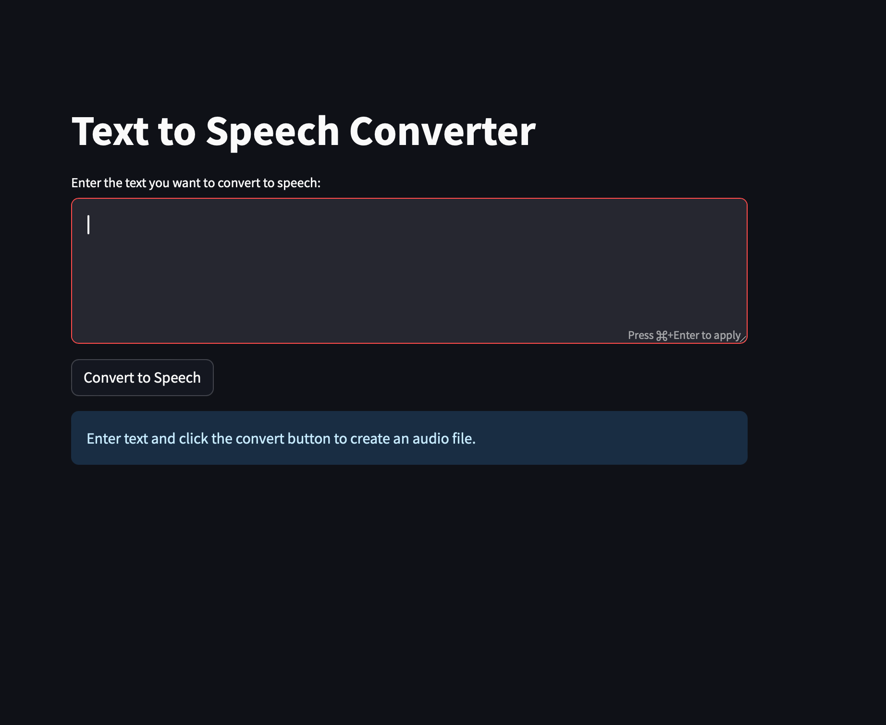

# Text-2-Speech-using-ElevenLabs-API

This application uses the OpenAI API to convert text to speech and save the audio file as mp3 to local disk.

## Author

Tomas Vince - Cloud Architect | AI Enthusiast
Email: tomas.vince@gmail.com
Linkedin: https://www.linkedin.com/in/tomasvince/

## Features

- Reads input text from a file named "text-for-conversion.txt".
- Converts the input text to speech using the ElevenLabs API.
- Saves the resulting audio to a dedicated file into "audio-outputs" directory.
- The audio file is named in the format "speech-YYYY-MM-DD_HH-MM.mp3", where "YYYY-MM-DD_HH-MM" is the current date and time.

## 1. Setup

1. Create dedicated local folder on your computer for your project.
2. Clone GIT repository into your folder
3. Create virtual environment using following commands: `python3 -m venv venv` 
4. Activate virtual environment using following commands: `source venv/bin/activate` 
5. Install the required Python packages with `pip install -r requirements.txt`.
6. Rename file '.env.EXAMPLE' to ".env", open renamed file and set up your OpenAI API key. **(This step is required)**
7. Place the text you want to convert to speech in a file named "text-for-conversion.txt" and save. *(This step is required if you want to run text to speech conversion via CLI using dedicated python script tts-app.py)*
8. To run text-2-speech converter tool in more convenient way (via web ui) take a look at section **3. Streamlit web framework** for more details how to run Streamlit web framework.
9. Additional way (most convenient way) how to run converter tool is by running docker container. See **4. Run Text-2-Speech app as Docker container** section for technical details how to make it done.

## 2. Usage

Run the application with `python3 tts-app.py`.

## 3. Streamlit web framework

To create a Streamlit web application that incorporates the functionality of created Python script to convert text to an MP3 file, follow these steps. 

*Note: This guide assumes you have Streamlit and the necessary libraries (like openai) installed in your environment.*

This script is saved in a tts-using-stramlit.py file and can be run using Streamlit by navigating to the directory containing the script and running: 
`streamlit run tts-app-streamlit.py`

New browser tab will be opened with rendered web app:

Text for translation can be copied into text field and then button **Convert to Speech** has to be submitted. After processing **Download** button appears and user can download mp3 file locally on its computer.

## 4. Run Text-2-Speech app as Docker container

To build Docker image Dockerfile has been defined. 
Use following command to create docker image:

`docker build -t text-2-speech-converter-image .`

To run docker container from created docker image use following command:

`docker run --name Text-2-Speech-Converter --env-file=.env -p 8501:8501 text-2-speech-converter-image`

## Note

This application suppresses DeprecationWarnings. This is a temporary solution and it's generally a good idea to update your code to use the new methods when they become available.
